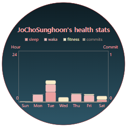
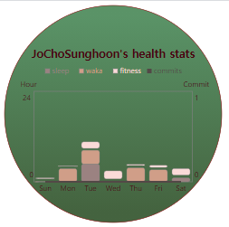
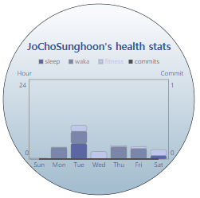
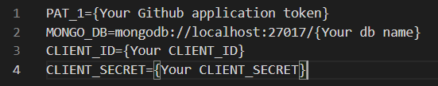
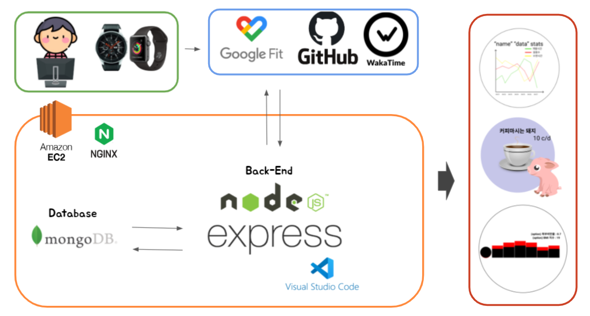

<p algin="center">
    
    <h1 align="center">Github Readme Health</h1>
	<p align="center">Let's do one-day one-exercise!</p>
</p>


# Features

- [Introduction](#introduction)
- [Gather Your Data](#gather-your-data)
- [Register Your Data](#register-your-data)
- [Chart Card](#chart-card)
- [Deploy on Your Own](#deploy-on-your-own)
- [Tech](#tech)
- [Contributer](#contributer)


# Introduction

Today, developers work in the same position for a long time.

And we can't exercise steadily.

This causes problems such as gaining weight or poor posture.

So, **Our service is aimed at a one-day one-exercise campaign for developers.**


# Gather Your Data

we compare development time and exercise time, then provide a cute card-view at your readme.

First of all, you need to collect data on exercise time and development time.

Our servive use wakatime for gathering development time, and google fitness application for gathering exercise time.

- [Install wakatime plugin at your IDEs](https://wakatime.com/plugins)
- [Install google fitness application on your cell phone](https://play.google.com/store/apps/details?id=com.google.android.apps.fitness&hl=ko&gl=US)

_As a note, If you use wakatime, then have to register username and set public your develop Info._


# Register Your Infos

Register your data for using our service.

We need your github username, wakatime username, wakatime api_key and google api token.

1. Access our register page.

```
https://k4a302.p.ssafy.io/api
```

2. Write your usernames and api_key.

3. Get a google api token by using button.

4. Register your Infos.


# Chart Card

Copy-paste this into your readme or other markdown editor.

Change the `?username=` value to your Github username.

```

```

## Themes

You can use variouse themes that we provide.

#### All thems:

defaultTheme, forest, blue




## Customization

You can customize the appearence of your Chart card-view with URL params.

for example,

```https://k4a302.p.ssafy.io/cards/chart?username=username&size=250&themes=forest```

#### Common Options:

- size - Card-view's size in your readme (pixel)

- themes - name of the themes, choose [available themes](./themes.md)


# Deploy on Your Own

1. Clone our project
2. [make Google Application and add CLIENT_ID & CLIENT_SECRET in .env file](./Google Fitness REST API.md)
3. [Create github application token](https://docs.github.com/en/github/authenticating-to-github/creating-a-personal-access-token), then add token as a value and 'PAT_1' as a key in .env file.
4. [Install mongoDB](https://www.mongodb.com/try/download/community)
5. Add 'MONGO_DB' as a key and host address of mongodb as a value in .env file.
6.  install packages ```npm install```
7. run application ```npm start``` or ```pm2 start ./bin/www```

*As a note, .env file example*

 


# Tech

| Platform                               | Languages           | Environment             |
| -------------------------------------- | ------------------- | ----------------------- |
| Gitlab, Jira, Notion, Node js, MongoDB | JavaScript,CSS,HTML | VS Code, AWS EC2, NginX |

|              |                                                    |
| ------------ | -------------------------------------------------- |
| architecture |  |


# Contributer

### Team Name: _Open-mind_

| Name                                                         | Github                                            | Role                |
| ------------------------------------------------------------ | ------------------------------------------------- | ------------------- |
| 김정웅, Jeongung Kim | [real100woong](https://github.com/real100woong)   | Team Leader         |
| 신다정, Dajeong Sin | [ShinDajeong](https://github.com/ShinDajeong)     | Deployment Leader   |
| 이석원, Seokwon Lee | [clalsw](https://github.com/clalsw)               | Presentation Leader |
| 조성훈, Seunghun Cho | [JoChoSunghoon](https://github.com/JoChoSunghoon) | Employment Leader   |
| 표기동, Kidong Pyo | [pyoki32](https://github.com/pyoki32)             | Ending Leader       |


# Supported

### __*This Project is supported by*__


###                  Samsung Software Academy for Youth


###     Samsung Electronics


###     Ministry of Employment and Labor, Korea

