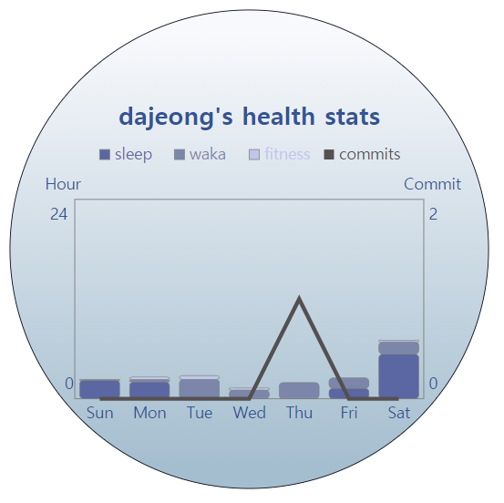
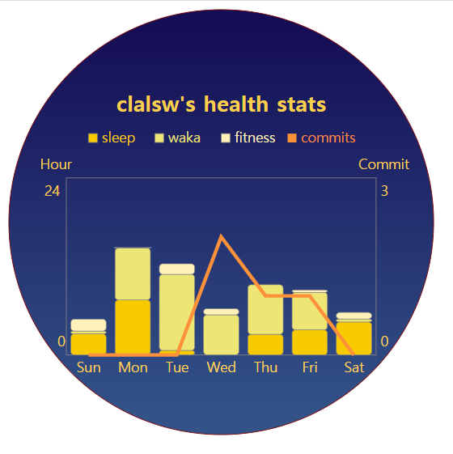
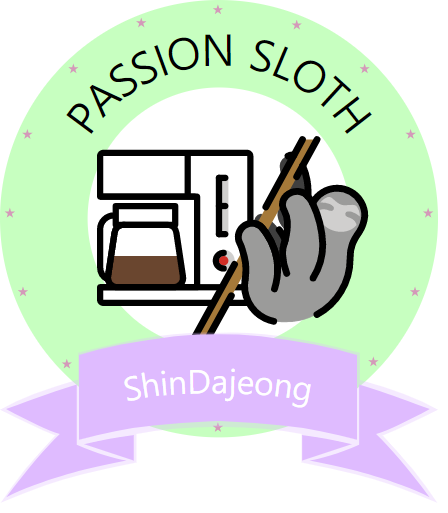
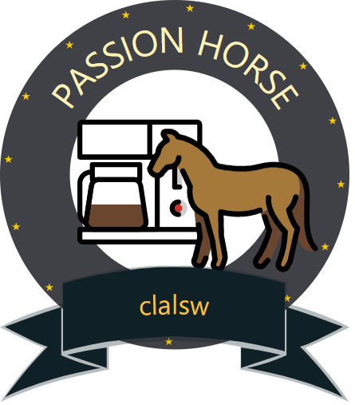
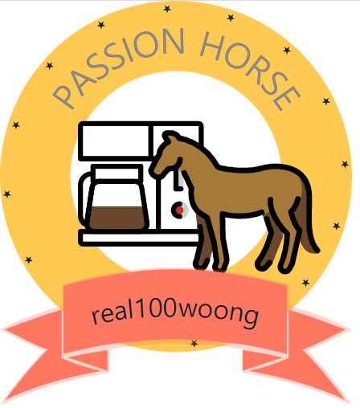
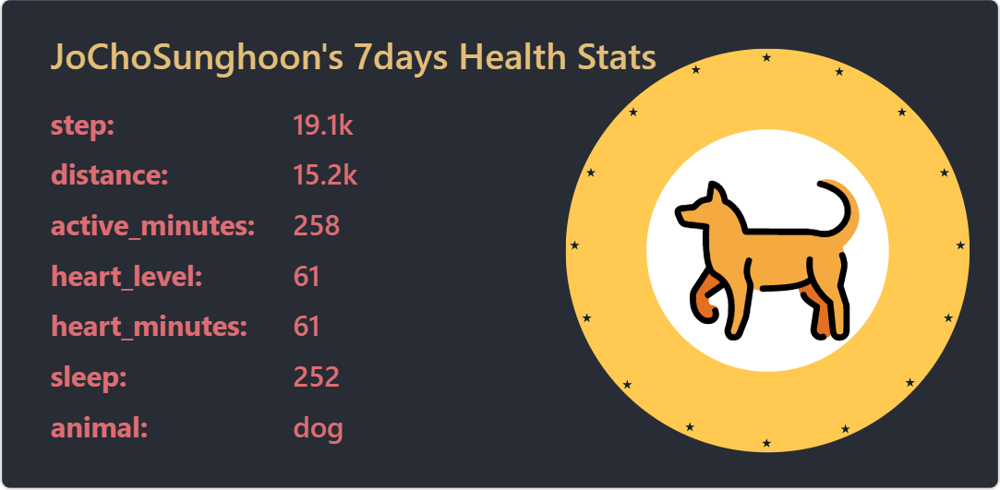

<p algin="center">
    
    <h1 align="center">Github Readme Health</h1>
	<p align="center">Let's do one-day one-exercise!</p>
</p>


# Features

- [Introduction](#introduction)
- [Gather Your Data](#gather-your-data)
- [Register Your Data](#register-your-data)
- [Chart Card](#chart-card)
- [Health Badge](#health-badge)
- [Health Stats](#health-stats)
- [Health Calendar](#health-calendar)
- [Deploy on Your Own](#deploy-on-your-own)
- [Tech](#tech)
- [Contributer](#contributer)
- [Supported](#supported)


# Introduction

Today, developers work in the same position for a long time.

And we can't exercise steadily.

This causes problems such as gaining weight or poor posture.

So, **Our service is aimed at a one-day one-exercise campaign for developers.**


# Gather Your Data

we compare development time and exercise time, then provide a cute card-view at your readme.

First of all, you need to collect data on exercise time and development time.

Our servive use wakatime for gathering development time, and google fitness application for gathering exercise time.

- [Install wakatime plugin at your IDEs](https://wakatime.com/plugins)
- [Install google fitness application on your cell phone](https://play.google.com/store/apps/details?id=com.google.android.apps.fitness&hl=ko&gl=US)

_As a note, If you use wakatime, then have to register username and set public your develop Info._


# Register Your Infos

Register your data for using our service.

We need your github username, wakatime username, wakatime api_key and google api token.

1. Access our register page.

```
https://github-readme-developer-health.com/api
```

2. Write your usernames and api_key.

3. Get a google api token by using button.

4. Register your Infos.


# Chart Card

> This chart card shows exercise time, development time, sleep time, and number of commits over a week.

Copy-paste this into your readme or other markdown editor.

Change the `?username=` value to your Github username.

```

```

## Themes

You can use variouse themes that we provide.

#### All themes:

defaultTheme, forest, blue, darkforest, cherry, night






## Customization

You can customize the appearence of your Chart card-view with URL params.

for example,

```https://github-readme-developer-health.com/cards/chart?username=pyoki32&size=250&theme=forest```

#### Common Options:

- size - Card-view's size in your readme (pixel)

- theme - name of the themes, choose [available themes](./github-readme-health/themes/chartTheme.js)


# Health Badge

> This badge calculates development time and exercise time to express your development habits in a cute way.
>
> If you work out hard, you can get dynamic animal picture, and if you work hard on developing, your drink will be upgraded.

Copy-paste this into your readme or other markdown editor.

Change the `?username=` value to your Github username.

```

```

## Themes

You can use variouse themes that we provide.

#### All themes:

default, pink, sky, forest, dark, sunset





## Customization

You can customize the appearence of your Health-badge with URL params.

for example,

```https://github-readme-developer-health.com/cards/badge?username=pyoki32&size=1.5&theme=forest```

#### Common Options:

- size - size proportional to the default size (default is 2)
- theme - name of the themes, choose [available themes](./github-readme-health/themes/circleThemes.js)


# Health Stats

> This Health stats shows a week's workout stats and shows dynamic animals if you exercise hard.

Copy-paste this into your readme or other markdown editor.

Change the `?username=` value to your Github username.

```

```

## Themes

You can use variouse themes that we provide.

#### All themes:

default, dark, radical, merko, tokyonight, onedark, cobalt, synthwave, highcontrast, dracula





## Customization

You can customize the appearence of your Health-Stats with URL params.

for example,

```https://github-readme-developer-health.com/cards/fit?username=pyoki32&theme=dark&badge_theme=pink```

#### Common Options:

- theme - name of the themes, choose [available themes](./github-readme-health/themes/index.js)
- badge_theme - theme name of animal badge, choose [available themes](./github-readme-health/themes/circleThemes.js)
- hide - Items you want to hide. for example, ```&hide=animal,sleep,...```
- hide_badge - boolean type param for showing animal badge, _true or false_
- hide_border - boolean type param for showing card view border, _true or false_
- show icons - boolean type param for showing icons of items, _true or false_


# Health Calendar

> This calandar marks the time you worked out every day and expresses it as if the grapes are ripe.
>
> It's a timeline that can mark 'one-day one-exercise' well like github's grass.

Copy-paste this into your readme or other markdown editor.

Change the `?username=` value to your Github username.

```

```

## Themes

You can use variouse themes that we provide.

#### All themes:

default, grape, sky, green, orange, grass


images

## Customization

You can customize the appearence of your Health-Calendar with URL params.

for example,

```https://github-readme-developer-health.com/cards/calendar?username=pyoki32&theme=grape```

#### Common Options:

- theme - name of the themes, choose [available themes](./github-readme-health/themes/calendarTheme.js)


# Deploy on Your Own

1. Clone our project
2. [make Google Application and add CLIENT_ID & CLIENT_SECRET in .env file](./Google Fitness REST API.md)
3. [Create github application token](https://docs.github.com/en/github/authenticating-to-github/creating-a-personal-access-token), then add token as a value and 'PAT_1' as a key in .env file.
4. [Install mongoDB](https://www.mongodb.com/try/download/community)
5. Add 'MONGO_DB' as a key and host address of mongodb as a value in .env file.
6.  install packages ```npm install```
7. run application ```npm start``` or ```pm2 start ./bin/www```

*As a note, .env file example*

 


# Tech

| Platform                               | Languages           | Environment             |
| -------------------------------------- | ------------------- | ----------------------- |
| Gitlab, Jira, Notion, Node js, MongoDB | JavaScript,CSS,HTML | VS Code, AWS EC2, NginX |

|              |                                                    |
| ------------ | -------------------------------------------------- |
| architecture |  |


# Contributer

### Team Name: _Open-mind_

| Name                                                         | Github                                            | Role                |
| ------------------------------------------------------------ | ------------------------------------------------- | ------------------- |
| 김정웅, Jeongung Kim | [real100woong](https://github.com/real100woong)   | Team Leader         |
| 신다정, Dajeong Shin | [ShinDajeong](https://github.com/ShinDajeong)     | Deployment Leader   |
| 이석원, Seokwon Lee | [clalsw](https://github.com/clalsw)               | Presentation Leader |
| 조성훈, Sunghoon Cho | [JoChoSunghoon](https://github.com/JoChoSunghoon) | Employment Leader   |
| 표기동, Kidong Pyo | [pyoki32](https://github.com/pyoki32)             | Ending Leader       |


# Supported

### __*This Project is supported by*__


###                         [](https://www.ssafy.com/ksp/jsp/swp/swpMain.jsp)                 Samsung Software Academy for Youth


### [](https://www.samsung.com/sec/business/)    Samsung Electronics


### [](http://www.moel.go.kr/index.do)    Ministry of Employment and Labor, Korea

