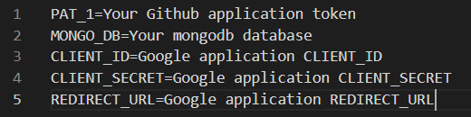

<p algin="center">
    
    <h1 align="center">Github Readme Developer Health</h1>
	<p align="center">Let's do one-day one-exercise!</p>
	<p align="center" color="#00ff00">Commit your health in your github</p>
</p>


# Features

- [1. Introduction](#1.-introduction)
- [2. Gather Your Data](#2.-gather-your-data)
- [3. Register Your Infos](#3.-register-your-infos)
  - [3-1. Re-Register Your Infos](#3-1.-re-register-your-infos)
- [4. Views](#4.-views)
  - [4-1. Health Chart Badge](#4-1.-health-chart-badge)
  - [4-2. Health Stats Badge](#4-2.-health-stats-badge)
  - [4-3. Health Stats Card](#4-3.-health-stats Card)
  - [4-4. Health Calendar Card](#4-4.-health-calendar-card)
- [5. Deploy on Your Own](#5.-deploy-on-your-own)
- [6. Tech](#6.-tech)
- [7. Contributer](#7.-contributer)
- [8. Reference](#8.-reference)
- [9, Acknowledgement](#9.-supported)


# 1. Introduction

Today, developers work in the same position for a long time.

And we can't exercise steadily.

This causes problems such as gaining weight or poor posture.

So, **Our service is aimed at a one-day one-exercise campaign for developers.**


# 2. Gather Your Data

We compare development time and exercise time, then provide a cute card-view at your readme.

First of all, you need to collect data on exercise time and development time.

Our servive use wakatime for gathering development time, and google fitness application for gathering exercise time.

Wakatime is a plugin on IDEs for estimating your coding time.

Google fitness is a cell-phone application for checking your exercise.

- [Install wakatime plugin at your IDEs](https://wakatime.com/plugins)
- [Install google fitness application on your cell phone](https://play.google.com/store/apps/details?id=com.google.android.apps.fitness&hl=ko&gl=US)

_As a note, If you use wakatime, then have to register username and set public your develop Info._


# 3. Register Your Infos

Register your data for using our service.

We need your github username, wakatime username, wakatime api_key and google api token.


1. Access our register page.

```
https://github-readme-developer-health.com/home
```

2. Write your usernames and api_key.

3. Get a google api token by using button.

4. Register your Infos.

5. Create the same repository as your github ID and create a README.md file.

6. Write in README.md as desired in the script below.

   ```
   
   
   
   
   
   
   
   ```

7.  Please refer to the document below for customization.

# 3-1. Re-Register Your Infos

1. Please refer to the following document and delete our application permissions.
   - [delete application permissions](https://www.notion.so/Note-How-to-remove-third-party-account-access-8ea5291859664c4db94e8a18f8a46000)
2. Follow the above precedure [#3](#3.-register-your-infos) again.


# 4. Views

# 4-1. Health Chart Badge

> This chart card shows exercise time, development time, sleep time, and number of commits over a week.

Copy-paste this into your readme or other markdown editor.

Change the `?username=` value to your Github username.

```

```

## Themes

You can use variouse themes that we provide.

#### All themes:

defaultTheme, forest, blue, darkforest, cherry, night


## Customization

You can customize the appearence of your Health-Chart-Badge with URL params.

for example,

```https://github-readme-developer-health.com/cards/chart?username=pyoki32&size=250&theme=forest```

#### Common Options:

- `size` - Card-view's size in your readme (default size is 350 pixel)
- `theme` - name of the themes, choose [available themes](./github-readme-developer-health/themes/chartTheme.js)
- cache_seconds - set the cache header manually _(min: 1800, max: 86400)_

_As a note, have a default cache of 4 hours (14400 seconds)_


# 4-2. Health Stats Badge

> This health badge calculates development time and exercise time to express your development habits in a cute way.
>
> If you work out hard, you can get dynamic animal picture, and if you work hard on developing, your drink will be upgraded.

Copy-paste this into your readme or other markdown editor.

Change the `?username=` value to your Github username.

```

```

**_As a Note, Please [click](./algorithm.md) if you want to check our object selection algorithm policy._**


## Themes

You can use variouse themes that we provide.

#### All themes:

default, pink, sky, forest, dark, sunset


## Customization

You can customize the appearence of your Health-Stats-Badge with URL params.

for example,

```https://github-readme-developer-health.com/cards/badge?username=pyoki32&size=1.5&theme=forest```

#### Common Options:

- `theme` - name of the themes, choose [available themes](./github-readme-developer-health/themes/circleThemes.js)
- `size` - size proportional to the default size (default is 2)
- cache_seconds - set the cache header manually _(min: 1800, max: 86400)_


# 4-3. Health Stats Card

> This health stats shows a week's workout stats and shows dynamic animals if you exercise hard.

Copy-paste this into your readme or other markdown editor.

Change the `?username=` value to your Github username.

```

```

## Themes

You can use variouse themes that we provide.

#### All themes:

default, dark, radical, merko, tokyonight, onedark, cobalt, synthwave, highcontrast, dracula


## Customization

You can customize the appearence of your Health-Stats-Card with URL params.

for example,

```https://github-readme-developer-health.com/cards/fit?username=pyoki32&theme=dark&badge_theme=pink```

#### Common Options:

- `theme` - name of the themes, choose [available themes](./github-readme-developer-health/themes/index.js)
- `badge_theme` - theme name of animal badge, choose [available themes](./github-readme-developer-health/themes/circleThemes.js)
- `hide` - Items you want to hide. for example, ```&hide=animal,sleep,...```
- hide_badge - boolean type param for showing animal badge, _true or false_
- hide_border - boolean type param for showing card view border, _true or false_
- show icons - boolean type param for showing icons of items, _true or false_
- cache_seconds - set the cache header manually _(min: 1800, max: 86400)_


# 4-4. Health Calendar Card

> This health calandar marks the time you worked out every day and expresses it as if the grapes are ripe.
>
> It's a timeline that can mark 'one-day one-exercise' well like github's grass.

Copy-paste this into your readme or other markdown editor.

Change the `?username=` value to your Github username.

```

```

## Themes

You can use variouse themes that we provide.

#### All themes:

default, grape, sky, green, orange, grass


## Customization

You can customize the appearence of your Health-Calendar-Card with URL params.

for example,

```https://github-readme-developer-health.com/cards/calendar?username=pyoki32&theme=grape```

#### Common Options:

- `theme` - name of the themes, choose [available themes](./github-readme-developer-health/themes/calendarTheme.js)
- `size` - size proportional to the default size (default is 5)
- `outline` -  boolean type param for showing day border, _true or false_
- animation - boolean type param for showing hover and fade in, _true or false_
- hide - boolean type param for showing summary , _true or false_
- cache_seconds - set the cache header manually _(min: 1800, max: 86400)_


# 5. Deploy on Your Own

1. Clone our project.
2. [Make Google Application and add CLIENT_ID & CLIENT_SECRET in .env file](./Google Fitness REST API.md).
3. Add redirect_url that is written in Google application.
4. [Create github application token](https://docs.github.com/en/github/authenticating-to-github/creating-a-personal-access-token), then add token as a value and 'PAT_1' as a key in .env file.
5. [Install mongoDB](https://www.mongodb.com/try/download/community).
6. Add 'MONGO_DB' as a key and host address of mongodb as a value in .env file.
7. Install packages ```npm install```.
8. Run application ```npm start``` or ```pm2 start ./bin/www```.

*As a note, .env file example*

 


# 6. Tech

| Platform                               | Languages           | Environment             |
| -------------------------------------- | ------------------- | ----------------------- |
| Gitlab, Jira, Notion, Node js, MongoDB | JavaScript,CSS,HTML | VS Code, AWS EC2, NginX |

|              |                                                    |
| ------------ | -------------------------------------------------- |
| architecture |  |


# 7. Contributer

### Team Name: _OpenCommit-H_

| Name                                                         | Github                                            | Role                |
| ------------------------------------------------------------ | ------------------------------------------------- | ------------------- |
| 김정웅, Jeongung Kim | [real100woong](https://github.com/real100woong)   | Team Leader         |
| 신다정, Dajeong Shin | [ShinDajeong](https://github.com/ShinDajeong)     | Deployment Leader   |
| 이석원, Seokwon Lee | [clalsw](https://github.com/clalsw)               | Presentation Leader |
| 조성훈, Sunghoon Cho | [JoChoSunghoon](https://github.com/JoChoSunghoon) | Employment Leader   |
| 표기동, Kidong Pyo | [pyoki32](https://github.com/pyoki32)             | Ending Leader       |


# 8. Reference

We Thanks to [anuraghazra](https://github.com/anuraghazra/github-readme-stats) because we were inspired to see your open source.


# 9. Acknowledgement

### __*This Project is supported by*__ 


###                         [](https://www.ssafy.com/ksp/jsp/swp/swpMain.jsp)                 Samsung Software Academy for Youth


### [](https://www.samsung.com/sec/business/)    Samsung Electronics Co., Ltd.


### [](http://www.moel.go.kr/index.do)    Ministry of Employment and Labor, Korea

